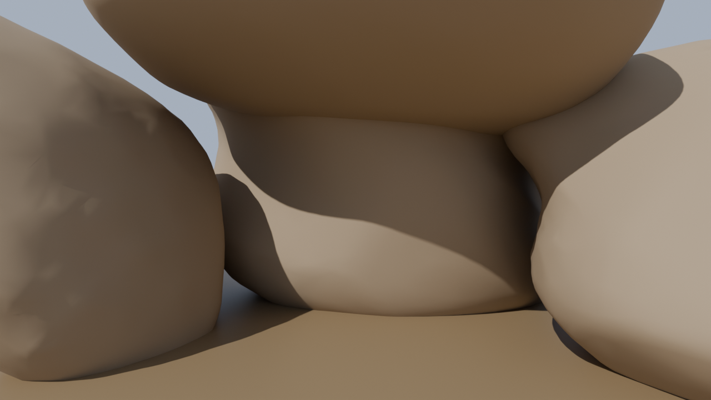

# Props

## Boulders (`tools/blender/create_boulders.py`)

Rounded, weathered granite after the Mojave's (Joshua Tree), from Blender's Rock Generator
add-on at fixed seeds (`add-echo-grotto`). Five variants make the echo grotto, a cluster
in the opening scene with a small grotto at its base; their near meshes are acoustic rock
(glTF extras `"acoustic": "rock"`). CC0: generated geometry.




| Variant | Role | Size (m) |
| ------- | ---- | -------- |
| `boulder_0` | back | 9 × 7 × 6.5 |
| `boulder_1` | left | 7 × 6 × 5.5 |
| `boulder_2` | right | 6.5 × 6 × 5 |
| `boulder_3` | the leaning top, roofing the alcove | 8 × 6 × 3.6 |
| `boulder_4` | a small rock in front | 3 × 2.5 × 2 |

## Desert props (`tools/blender/create_desert_props.py`)

The bleak opening's scatter, each with its bloomed counterpart (`add-art-direction` 2.6).


| Family | Bleak | Bloomed | Triangles |
| ------ | ----- | ------- | --------- |
| `desert_brush_<k>` | low grey twiggy dead shrub | small leaf clusters, a few luminous magenta flowers | 2.9k–4.4k |
| `desert_stump_<k>` | bleached snag, jagged break, flared roots | wood darkens with damp, moss, luminous cyan mushrooms at its foot | 1.3k–1.7k |
| `desert_debris_<k>` | scatter of curled, broken mud plates | sprouts pushing up between the plates | 0.2k–0.3k |

**Bloom** (0 bleak .. 1 bloomed) follows the local light quality, the field that blends
the world from bleak to bloomed. Each `Bloom_<n>` node scales in over its own slice
of the range (extras `from`, `to`), so a prop blooms gradually; `DesertBrush_Twig`,
`DesertStump_Wood` and `DesertDebris_MudPlate` blend bleak → bloomed colour with it.
Props ship bleak.

Three seeded variants per family, plus per-instance scale, yaw and tilt from the world
seed and instance ID. Contract: `desert/asset.json`.

```sh
~/.local/bin/blender -b --factory-startup -P tools/blender/create_desert_props.py
~/.local/bin/blender -b --factory-startup -P tools/blender/create_desert_props.py -- stump 1
```
